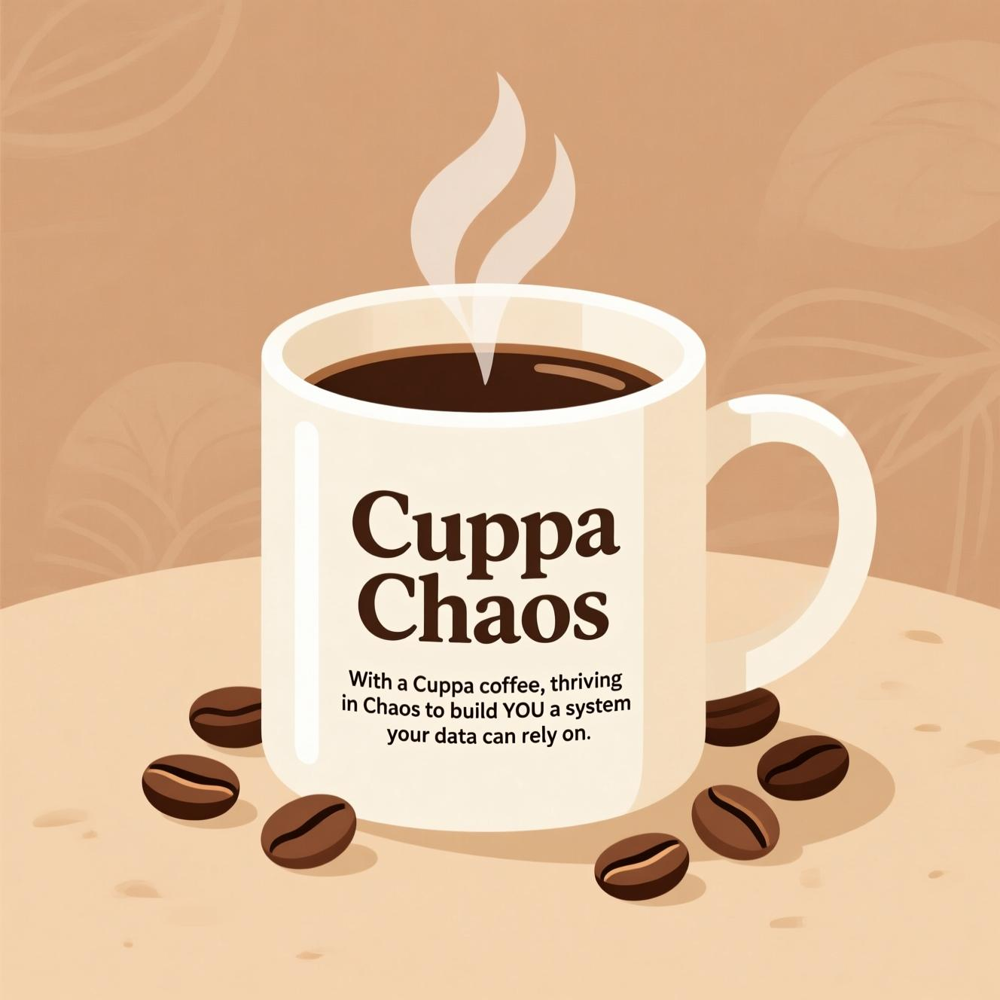

## Generation Data Engineering Final Project - 

## CuppaChaos - AWS ETL Pipeline 
                                         
										                                    

--------------------------------------------------------------------------------------------------------------------------------------------------------------------------------------------------------------------------------------
## Table of Contents 

----------------------------------------------------------------------------------------------------------------------------------------------------------------------------------------------------------------------------------------

* [Project Background](#project-background)
* [Project Overview](#project-overview)
* [Architechture & Database Schema](#architecture--database-schema)
  * [Local Workflow](#local-workflow)
  * [AWS Workflow](#aws-workflow)
  * [Database Schema](#database-schema)
* [Client Requirements & Our Plan](#client-requirements--our-plan)
* [Tech Stack](#tech-stack)
* [Porject Structure](#project-structure)
* [How To Run](#how-to-run)
  * [Local Setup](#local-setup)
  * [AWS Deployment](#aws-deployment)
* [Unit Testing](#unit-testing)
* [Local vs AWS Benefits](#local-vs-aws-benefits)
* [Challenges & Key Learning](#challenges--key-learnings)
* [Next Steps](#next-steps)
* [Team](#team)

--------------------------------------------------------------------------------------------------------------------------------------------------------------------------------------------------------------------------------------

## Project Background 

Cuppa Chaos — our data engineering team — was tasked with developing a scalable ETL pipeline for a rapidly expanding coffee chain. The company operates hundreds of branches across the country, each generating daily CSV files containing sales and order data. Currently, reporting is limited to branch-level insights, which makes it difficult to quickly identify trends or analyse overall business performance. 

As a result, the business faces challenges such as: 
 - Limited visibility of best-selling products across the organisation. 
 - Difficulty comparing performance between branches. 
 - No single, consolidated source of truth for sales and order data.
 
--------------------------------------------------------------------------------------------------------------------------------------------------------------------------------------------------------------------------------------

## Project Overview 

Our solution: a modular ETL pipeline that works locally (PostgreSQL + Grafana) and in the cloud (AWS S3 + Lambda + Redshift). This provides scalable analytics, and real-time monitoring for the business.

--------------------------------------------------------------------------------------------------------------------------------------------------------------------------------------------------------------------------------------

## Architecture & Database Schema

### Architecture

### Local Workflow:

               CSV Files → Python ETL Scripts → PostgreSQL Database 

### AWS Workflow:

               CSV Files → S3 Bucket → AWS Lambda → Amazon Redshift → EC2 (Grafana Dashboards running on Docker)
                                   │
                                   └── CloudFormation (Infrastructure as Code)

### Database Schema
                     
    CREATE TABLE products (
      product_id UUID PRIMARY KEY,
      type TEXT NOT NULL,
      size TEXT,
      flavour TEXT,
      price NUMERIC(10,2) NOT NULL
 );

    CREATE TABLE branches (
      branch_id UUID PRIMARY KEY,
      branch_name TEXT UNIQUE NOT NULL
 );

    CREATE TABLE orders (
      order_id UUID NOT NULL,
      branch_id UUID NOT NULL REFERENCES branches(branch_id),
      product_id UUID NOT NULL REFERENCES products(product_id),
      quantity INT NOT NULL DEFAULT 1,
      order_date TIMESTAMP NOT NULL,
      total_price NUMERIC(10,2) NOT NULL,
      payment_method TEXT NOT NULL,
     PRIMARY KEY(order_id, product_id)
 );

-------------------------------------------------------------------------------------------------------------------------------------------------------------------------------------------------------------------------------------

## Client Requirements & Our Plan

The client required an end-to-end data engineering solution that could handle sales and order data from multiple coffee shop branches. The system needed to extract CSV data from each branch, remove any personally identifiable information (PII) to ensure GDPR compliance, and transform the data into a consistent, standardised format that could support analysis across the business.

To achieve this, our team designed Python extraction scripts that read raw CSVs and pass them through a transformation layer where PII is removed, UUIDs are generated for consistency, and validation checks ensure data quality. Once cleaned, the data is loaded into a central PostgreSQL database using a schema-first approach. Grafana dashboards were connected to this database to provide insights into branch performance, top products, and payment breakdowns.

For scalability, the pipeline was extended to AWS. Branch CSV files are ingested into S3, triggering AWS Lambda functions that handle transformations automatically. Processed data is then loaded into Amazon Redshift, enabling enterprise-scale analytics and faster querying across large datasets. Infrastructure is managed with CloudFormation, ensuring a repeatable and modular setup.

--------------------------------------------------------------------------------------------------------------------------------------------------------------------------------------------------------------------------------------

## Tech Stack

* Python 3 – CSV parsing, cleaning, transformation
* PostgreSQL – Relational storage with schema-first design
* Grafana – Dashboards & BI visualisation
* UUID – Consistent unique identifiers
* Docker – Local containerisation
* AWS (S3, Lambda, Redshift, EC2, SQS, CloudFormation) – Cloud ETL deployment
* Pytest – Unit testing

--------------------------------------------------------------------------------------------------------------------------------------------------------------------------------------------------------------------------------------

## Project Structure 

       final-project/cuppa-chaos-de-x6-generation/
      |___ Venv/                                                         # Virtual Environment 
      |   |__ bin/
      |   |__ lib/
      |   |__ pyvenv.cfg/
      |___Images/
      |   |__ team_logo.jpg
      │___sprint_1/
      │   ├── data/                                                      # Raw data CSV fikes 
      │   ├── databases/                                                 # Data schema 
      │   ├── extract.py                                                 
      │   ├── load2.py
      │   ├── sql_utils.py
      │   ├── test_transformation.py
      │   ├── transformation2.py
      │   └── trials_understand.py
      │
      │___sprint_2/
      │   ├── src/                                                      # ETL pipleline code 
      │   │   ├── cuppa-chaos-deployment-stack.yml
      │   │   ├── cuppa-chaos-etl-stack-packaged.yml
      │   │   ├── cuppa-chaos-etl-stack.yml
      │   │   └── etl_pipeline.py
      │   ├── deploy.ps1
      │   ├── deploy.sh
      │   ├── requirements-lambda.txt
      │   └── requirements.txt
      │
      │___sql_queries_tobe_deleted.sql                                
      │___transform_not_needed.py
      │___transform_orders.py
      │___transform_test.py                                            # Unit Tests 
      │___LICENSE
      │___README.md                                                    # Project Documentation 
      |___gitignore                                                    # Git ignore rules 

--------------------------------------------------------------------------------------------------------------------------------------------------------------------------------------------------------------------------------------

## How To Run 

### Local Setup

      Clone the repository
      git clone https://github.com/DE-X6-LM/cuppa-chaos-de-x6-generation.git
      cd final-project
      python -m venv venv
      source venv/bin/activate   # Windows: venv\Scripts\Activate.ps1

      macOS
     - python3 -m venv venv
     - source venv/bin/activate

     Install Dependencies

     Once the virtual environment is actiavted, install required packages:
     - pip install -r requirements.txt

     Run ETL locally:
     python sprint_1/extract.py
     python sprint_1/transformation.py
     python sprint_1/load.py

     Docker: Start Containers

      Ensure Docker Desktop is running. Then start the containers using:
     - docker compose up
     To run in the background:
     - docker compose up -d
     To stop containers:
     - docker compose down

### AWS Deployment

     ./deploy.sh     # Linux/Mac

     ./deploy.ps1    # Windows PowerShell

--------------------------------------------------------------------------------------------------------------------------------------------------------------------------------------------------------------------------------------

## Unit Testing

* PII removal – Ensuring no personal data remains in outputs. 
* UUID patching – Verifying UUID generation and usage in transformed data. 
* Schema validation – Confirms referential integrity.

Run all tests 

     pytest -v

--------------------------------------------------------------------------------------------------------------------------------------------------------------------------------------------------------------------------------------

## Local vs AWS Benefits

Local (PostgreSQL + Grafana)
* Quick development and debugging
* No cloud costs
* Immediate visualisation
* Great for prototyping

AWS (S3 + Lambda + Redshift)
* Scales to large datasets
* Modular & decoupled services
* Serverless → low infrastructure management
* Production-ready architecture

--------------------------------------------------------------------------------------------------------------------------------------------------------------------------------------------------------------------------------------

## Challenges & Key Learnings

Challenges we faced:

At first, connecting Grafana to our EC2 instance was a struggle. We solved this by implementing Docker, which standardised the environment and allowed Grafana to run smoothly.
We also ran into several issues when loading data locally. This required extensive debugging of our transformation and load scripts, but after careful testing and fixes, the pipeline now works correctly end-to-end in the local setup.
Our current challenge is loading into Amazon Redshift. The S3 bucket and Lambda functions are working as expected, but when the load step runs, we keep getting a “no rows inserted” error. We are actively debugging our AWS load script to resolve this.

Key Learnings:

Containerisation with Docker can simplify setup and resolve environment-specific issues.
Debugging transformation and load scripts early helps ensure reliability before scaling to the cloud.
AWS services often work well individually, but integrating them into a seamless pipeline requires careful troubleshooting.
Persistence and teamwork are essential — especially when hitting roadblocks like Redshift integration.

--------------------------------------------------------------------------------------------------------------------------------------------------------------------------------------------------------------------------------------

## Next Steps 

* Finalise Amazon Redshift integration → scalable cloud warehouse
* Extend Grafana dashboards with advanced BI features
* Add predictive analytics (sales forecasting, customer behaviour)
* Implement AWS SQS (Simple Queue Service) → reliable message queuing
* Implement AWS SNS (Simple Notification Service) → automated alerts & notifications
* Automate scheduling with AWS EventBridge
* Explore real-time data streaming for instant branch visibility

 -------------------------------------------------------------------------------------------------------------------------------------------------------------------------------------------------------------------------------------

 ## Team 

 CuppaChaos - Generation Data Engineering Bootcamp (2025)

 * Zoya Khan
 * Hiyab Tewelde G
 * Mohammed KA
 
 --------------------------------------------------------------------------------------------------------------------------------------------------------------------------------------------------------------------------------------
